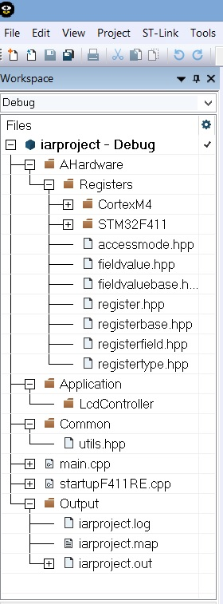

:toc: macro

:figure-caption: Рисунок
:toc-title: Оглавление

include::Titul_list_Laba1.adoc[]

toc::[]

---
[.text-left]
== Цель лабораторной работы
Знакомство со средой разработки IAR Embedded.

[.text-left]
== Задание 1
=== 1. Создать проект C++ c main.cpp

(Выполнено во время практического занятия 2)

=== 2. Подключить к проекту файл cstartup.cpp

(Выполнено во время практического занятия 3)

=== 3. Абстрактное программное обеспечение /Регистры /Значения файлов, Общие, Приложения, FreeRTOS

(Выполнено во время практического занятия 3)

=== 4. Создать структуру проекта в соотвествии со структурой папок

[#Финальная структура проекта]
.Финальная структура проекта

=== 5. Настроить STACK, HEAP

Стек (англ. Stack - стопка; читается стэк) - абстрактный тип данных, представляющий собой список элементов, организованных по принципу LIFO (англ. last in — first out, «последним пришёл — первым вышел»).

В стек можно положить данные, и можно данные забрать, причем те данные которые были положены в стек последним, забираем из стека первым

Стек – это организация памяти, выполненная компоновщиком. На уровне микроконтроллера для работы со стеком есть специальные ассемблерные команды (например PUSH – положить регистры в стек, и POP – взять из стека). Так же для сохранения и считывания данных из стека могут использоваться инструкции STR и LDR
//
//Правила задания размера стека
//В большинстве "традиционных" платформ стек растет сверху-вниз: от старших адресов к младшим. Поэтому прежде всего нужно верно указать размер или вершину стека. Для того, чтобы сделать это есть пара правил:

//Всегда считаем, что все локальные переменные создаются на стеке (Хотя часть из них могут быть созданы и на регистрах)

//У нас 16 регистров + регистры блока с плавающей точкой. Которые должны быть сохранены на стеке

//Каждая вложенная подпрограмма должна сохранить на стеке все данные из пункта 1 и 2. Т.е. если вложенность будет 2, то и сохранять придется примерно в два раза больше данных

//Каждое прерывание должно сохранить данные из пункта 1 и 2.

//Установка размера стека
//Обычно размер стека вычисляется эмпирически и задается с небольшим запасом.

//Чтобы задать размер стека, нужно нажав на правую кнопку мыши на проекте, выбрать Option⇒Linker и нажать кнопку Edit, далее выбрать закладку Stack/Heap Size, см. [Установка размера стека и кучи]

//500
//Рисунок 22. Установка размера стека и кучи
//Тоже самое можно сделать руками в файле stm32f411xE.icf, поменяв значение символа __ICFEDIT_size_cstack

//Контроль за размер стеком
//IAR Workbench имеет встроенные средства для контроля стека на этапе сборки он может указать максимально возможный размер стека для вашего приложения для самой глубокой цепочки вызова функций.

//Это значение можно использовать как ориентир при установке максимального значения стека. Однако следует помнить, что во-первых, в вашей программе возможно никогда не будет самой глубокой цепочки вложенности, а во вторых не всегда компоновщик сможет определить верно размер, например, при использовании ОСРВ, указатель стека постоянно изменяется и стек выделяется под каждую задачу отдельно, в итоге вся программа может работать вообще без единого стека и его размер можно минимальным. Зато придется указывать размер стека для каждой задачи при её создании. В любом случае, очень полезно знать об этой особенности и как её задействовать.
//
//Для включения достаточно поставить галочку в меню Option⇒Linker⇒Advanced⇒Enable stack usage analysis см. [Опция анализа глубины стека]

//400
//Рисунок 23. Опция анализа глубины стека
//Доступ к данным по анализу размеру стека
//После установки этой опции на выходе компоновщика в файле с раcширением *.map можно будет увидеть результат анализа, например, такой:

//Call Graph Root Category  Max Use  Total Use
//------------------------  ------ - -------- -
//Program entry                896        896
//Uncalled function              0          0

//Program entry
//"__iar_program_start": 0x08005291

//Maximum call chain                              896  bytes

//"__iar_program_start"                           8
//"__cmain"                                       0
//"main"                                         88
//"std::ostream::operator <<(float)"             80
//"std::numpunct<char>::grouping() const"         8
//"std::numpunct<char>::do_grouping() const"      8
//"std::string::basic_string(char const *)"      16
//"std::string::assign(char const *)"            16
//"std::string::assign(char const *, unsigned int)" 16
//"std::string::assign(const std::string&, unsigned int, unsigned int)" 32
//"std::string::_Grow(unsigned int, bool)"        16
//"std::string::_Copy(unsigned int, unsigned int)" 32
//В данном случае анализ стека показывает, что размер стека при максимальной цепочке вложенности может быть 896 байт.
//
//Куча  (англ. heap) - .структура данных с помощью которой организуется динамически распределение памяти приложения. Размер кучи — размер памяти, выделенной операционной системой (ОС) для хранения кучи (под кучу).

//Компоновщик выделяет раздел памяти под кучу в соответствии с заданным размером кучи, а при запуске программы происходит инициализация кучи, в ходе которой память, выделенная под кучу, отмечается как свободная.

//Куча используется только при динамически выделяемой памяти, для нас это означает, что все объекты созданные с помощью оператора new будут расположены в куче.

//Механизм выделения памяти описывать не будем, просто нужно запомнить, что если объект создан с помощью оператора new, то все его содержимое хранится в куче.

//Я не советую использовать динамическое создание объектов. Так как динамческое выделение памяти не рекомендуется для использования в надежном ПО. Лучше делать все объекты статическими.

//Определение размера кучи
//Как определить размер кучи, необходимой под кучу. Можно вооружиться несколькими правилами:

//Чтобы узнать размер объекта в куче, можно воспользоваться оператором sizeof, который может вернуть вам размер в байтах типа объекта (собственно, он будет равен размеру объекта расположенному в куче). Таким образом узнав размер всех объектов, можно приблизительно вычислить необходимый размер кучи

//Поскольку на кучи объекты могут как создаваться так и удаляться из неё, то куча может получаться неаргументированной, т.е. между объектами может быть пустая, незаполненная память. Поэтому если вы постоянно создаете и удаляете объекты, нужно учитывать этот факт и брать размер кучи с запасом.

//Размер кучи зависит от алгоритма работы вашей программы, если вы будете создавать и удалять последовательно объекты 100 раз, то нет никакого резона создавать кучу на 100 объектов, вполне разумно, создать кучу под 1-2 объекта с запасом на дефрагментацию – скажем 20% и все.

//Как вы поняли использование кучу несет ряд трудностей с расчетом её размера, помимо этого использование кучи может тормозить выполнение программы., см, например, [Обзор одной российской RTOS]. Поэтому во встроенном ПО использование кучи не приветствуется, по возможности её надо избегать, однако некоторые архитектурные приемы невозможны без использования динамических объектов (например для позднего связывания, или факта того, что мы не хотим использовать глобальные объекты), поэтому использовать в курсовых вы можете, но с одним условием, в нашем программном обеспечении созданные динамические объекты никогда не должны удаляться. Таким образом мы избежим дефрагментации кучи, а также слежением за памятью.

//Для задачи размера кучи, нужно сделать те же действия что для задания размера стека, см. Установка размера стека

Далее необходимо настроить стек (STACK) и кучу (HEAP).

Обычно размер стека вычисляется экспериментально и задается с небольшим запасом. Но также существуют правила задания размера стека:

принято считать, что все локальные переменные создаются на стеке (хотя часть из них могут быть созданы и на регистрах);

есть 16 регистров + регистры блока с плавающей точкой, которые должны быть сохранены на стеке;

каждая вложенная подпрограмма должна сохранить на стеке все данные из пункта 1 и 2. То есть если вложенность будет 2, то и сохранять придется примерно в два раза больше данных;

каждое прерывание должно сохранить данные из пункта 1 и 2.

Чтобы задать размер стека и кучи, нужно нажав на правую кнопку мыши на проекте, выбрать Option⇒Linker и нажать кнопку Edit, далее выбрать закладку Stack/Heap Size (рисунок 2).

#Размер стека и кучи
Рисунок 2. Установка размера стека и кучи
В main.cpp была написана программа для включения светодиода

#include "rccregisters.hpp" // for RCC
#include "gpioaregisters.hpp" // for GPIOA
#include "gpiocregisters.hpp" // for GPIOC

std::uint32_t SystemCoreClock = 16'000'000U;

extern "C"
{
int __low_level_init(void)
{
}
}

void delay(int cycles)
{
  for(int i = 0; i < cycles; ++i)
  {
    asm volatile("");
  }
}

int main()
{
  //Подать тактирование на порт A
  RCC::AHB1ENR::GPIOAEN::Enable::Set() ;
  //Подать тактирование на порт C
  RCC::AHB1ENR::GPIOCEN::Enable::Set() ;
  //Порт A.5 на вывод
  GPIOA::MODER::MODER5::Output::Set() ;
  //Порта C.5, C.8, C.9 на вывод
  GPIOC::MODER::MODER5::Output::Set() ;
  GPIOC::MODER::MODER8::Output::Set() ;
  GPIOC::MODER::MODER9::Output::Set() ;

  for(;;)
  {

     GPIOA::ODR::ODR5::High::Set();
     GPIOC::ODR::ODR5::High::Set();
     delay(1000000);
     GPIOA::ODR::ODR5::Low::Set();
     GPIOC::ODR::ODR5::Low::Set();
     delay(1000000);
  }

  return 1;
}
=== 6. Скопировать содержимое папки Registers и Common с проекта преподавателя в свою папку

=== 7. Написать программу в main.cpp

//Обычно размер стека вычисляется экспериментально и задается с небольшим запасом. Но также существуют правила задания размера стека:

//принято считать, что все локальные переменные создаются на стеке (хотя часть из них могут быть созданы и на регистрах);

//есть 16 регистров + регистры блока с плавающей точкой, которые должны быть сохранены на стеке;

//каждая вложенная подпрограмма должна сохранить на стеке все данные из пункта 1 и 2. То есть если вложенность будет 2, то и сохранять придется примерно в два раза больше данных;

//каждое прерывание должно сохранить данные из пункта 1 и 2.

//Чтобы задать размер стека и кучи, нужно нажав на правую кнопку мыши на проекте, выбрать Option⇒Linker и нажать кнопку Edit, далее выбрать закладку Stack/Heap Size (рисунок 2).

=== 8. Посмотреть видео: https://youtu.be/uC0jJGfDxtM

== Задание 2
=== 1. Откомпилировать и отлинковать программу

=== 2. Загрузить программу в симуляторе

=== 3. Сделать пошаговую отладку

=== 4. Настроить Debugger на отладку через StLink

=== 5. Подключить плату к компьютеру

=== 6. Загрузить программу в плату

=== 7. Выполнить пошаговую отладку

=== 8. Описать полученный результат

=== 9. Посмотреть видео: https://youtu.be/c7CasTJKw7o

== Задание 3
=== 1. Запустить анализатор стека. Узнать рекомендуемый размер стека.

=== 2. Изменить в проекте размер стека на рекомендуемый

=== 3. Создать map файл

=== 4. Описать что написано в map файле

=== 5. Поставить размер кучи HEAP в 0. Объяснить почему так можно сделать. И почему STACK нельзя

=== 6. Добавить проект в Git и сделать синхронизацию с GitHub

=== 7. Сделать отчет по каждому пункту каждого задания в файле .adoc. Выложить файл в GitHub

=== 8. Прислать ссылку на GitHub преподавателю для проверки

=== 9. Посмотреть видео: https://youtu.be/TajLTcjBgIg

== Выводы
[.text-left]
//Выводы по лабораторной работе

[.text-center]
== Ответы на контрольные вопросы
[.text-left]
// закоментировать или убрать, если таковых нет
