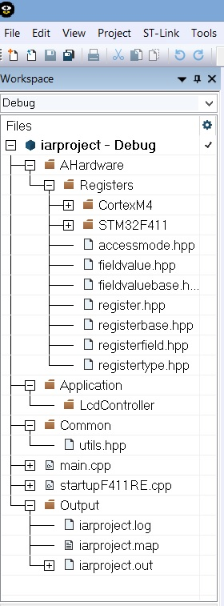
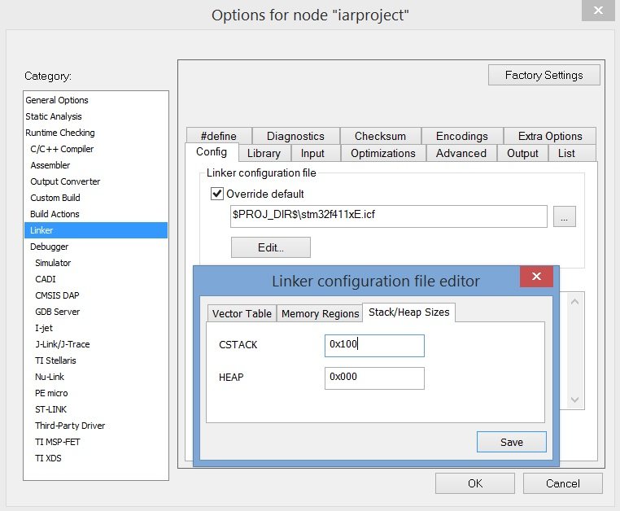
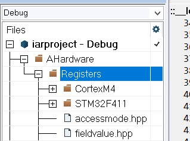
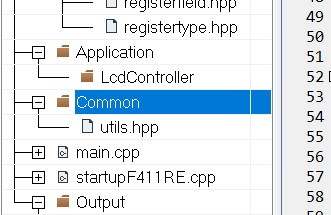
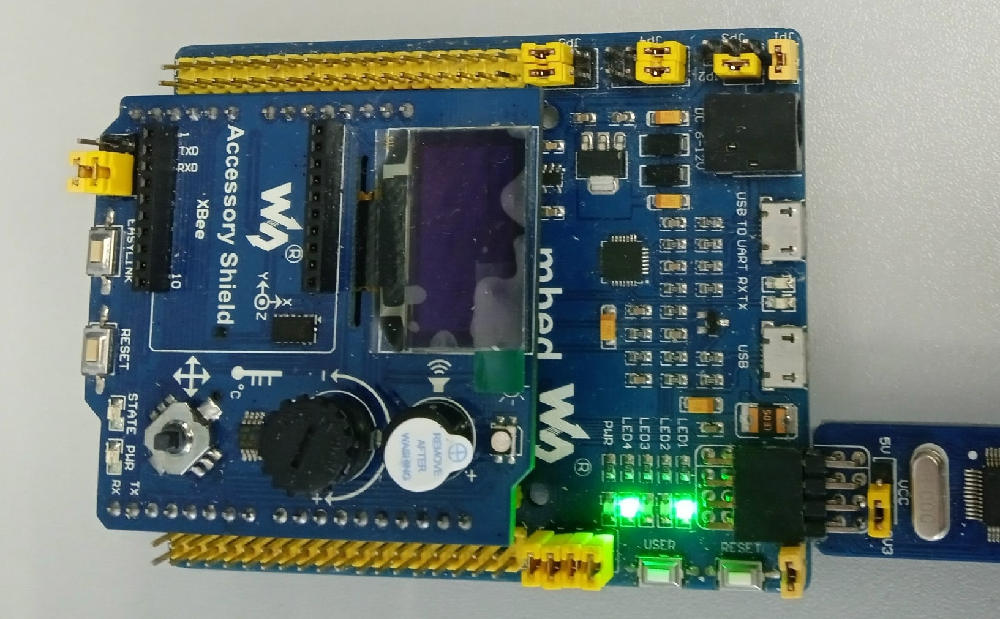
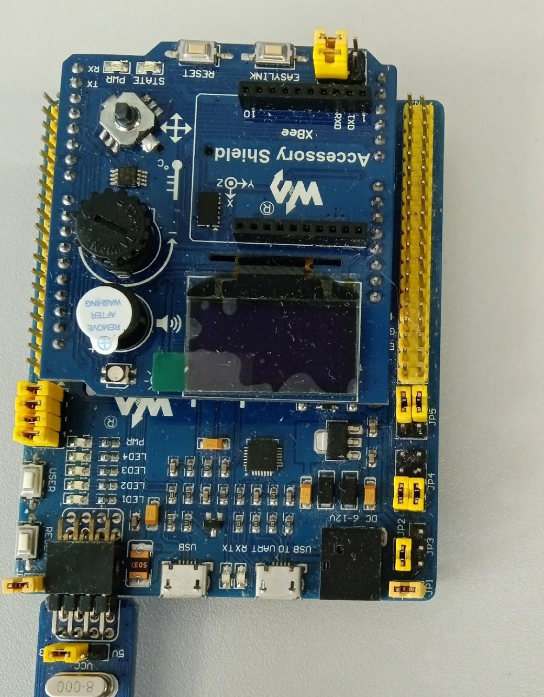
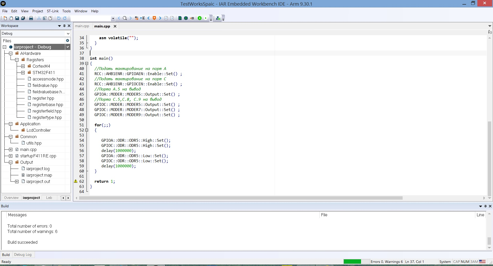
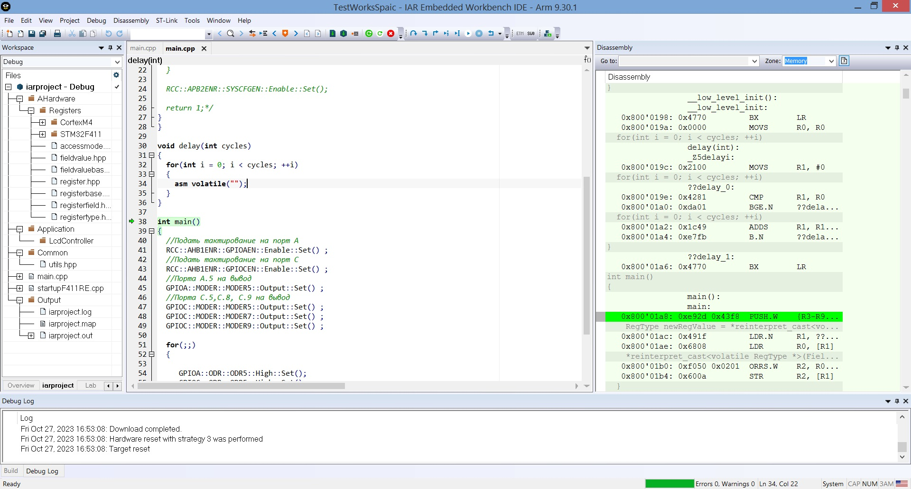
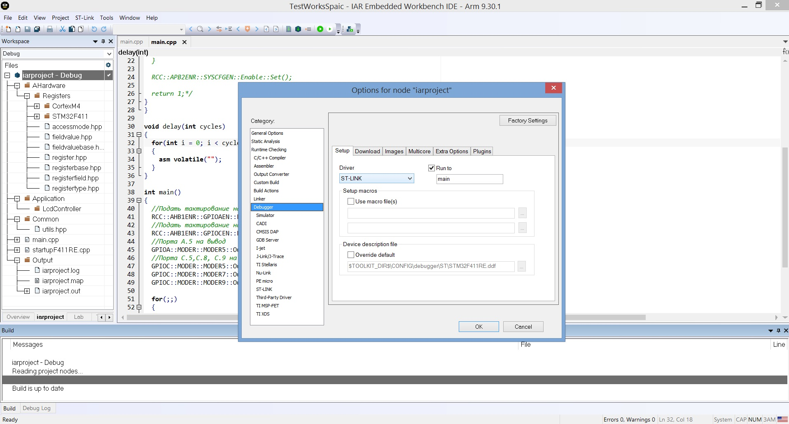
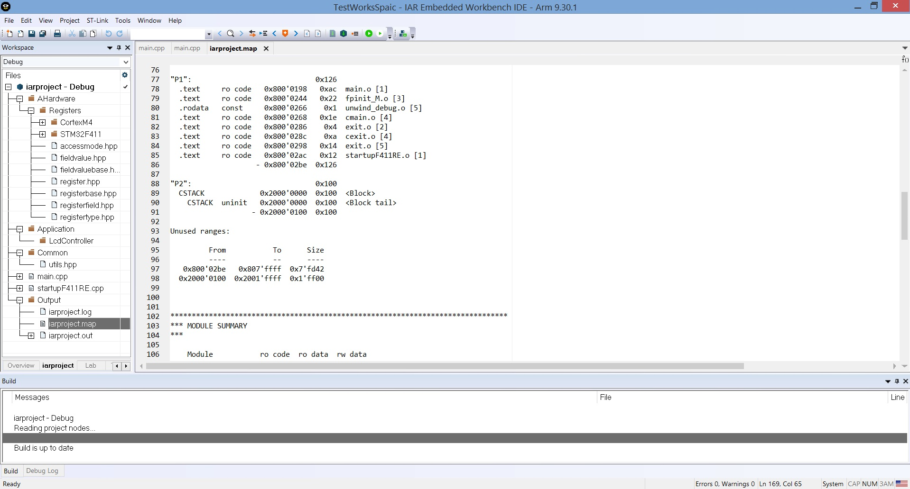

:toc: macro
:toc-title: Оглавление
:icons: font

:figure-caption: Рисунок

include::Titul_list_Laba1.adoc[]

toc::[]

---
[.text-left]
== Цель лабораторной работы
Знакомство со средой разработки IAR Embedded.

[.text-left]
== Задание 1
=== 1. Создать проект C++ c main.cpp

(Выполнено во время практического занятия 2)

=== 2. Подключить к проекту файл cstartup.cpp

(Выполнено во время практического занятия 3)

=== 3. Абстрактное программное обеспечение /Регистры /Значения файлов, Общие, Приложения, FreeRTOS

(Выполнено во время практического занятия 3)

=== 4. Создать структуру проекта в соотвествии со структурой папок

[#Финальная структура проекта]
.Финальная структура проекта

=== 5. Настроить STACK, HEAP

Стек (англ. Stack - стопка; читается стэк) - абстрактный тип данных, представляющий собой список элементов, организованных по принципу LIFO (англ. last in — first out, «последним пришёл — первым вышел»).

В стек можно положить данные, и можно данные забрать, причем те данные которые были положены в стек последним, забираем из стека первым

Стек – это организация памяти, выполненная компоновщиком. На уровне микроконтроллера для работы со стеком есть специальные ассемблерные команды (например PUSH – положить регистры в стек, и POP – взять из стека). Так же для сохранения и считывания данных из стека могут использоваться инструкции STR и LDR

Куча  (англ. heap) - .структура данных с помощью которой организуется динамически распределение памяти приложения. Размер кучи — размер памяти, выделенной операционной системой (ОС) для хранения кучи (под кучу).

Для задания размера стека и кучи, нужно сделать следующее:
1. Правой кнопкой мыши нажать на проект;
2. В разделе "Option" выбрать вкладку "Linker";
3. Нажать кнопку "EDIT";
4. Выбрать закладку "Stack/Heap Size"

[#Настройка стека и кучи]
.Настройка стека и кучи

=== 6. Скопировать содержимое папки Registers и Common с проекта преподавателя в свою папку

[#папка Registers]
.папка Registers

[#папка Common]
.папка Common

=== 7. Написать программу в main.cpp
В main.cpp была написана программа для включения светодиода

[source, cpp, linenums]

----
#include "rccregisters.hpp" // for RCC
#include "gpioaregisters.hpp" // for GPIOA
#include "gpiocregisters.hpp" // for GPIOC

std::uint32_t SystemCoreClock = 16'000'000U;

extern "C"
{
int __low_level_init(void)
{
}
}

void delay(int cycles)
{
  for(int i = 0; i < cycles; ++i)
  {
    asm volatile("");
  }
}

int main()
{
  //Подать тактирование на порт A
  RCC::AHB1ENR::GPIOAEN::Enable::Set() ;
  //Подать тактирование на порт C
  RCC::AHB1ENR::GPIOCEN::Enable::Set() ;
  //Порт A.5 на вывод
  GPIOA::MODER::MODER5::Output::Set() ;
  //Порта C.5, C.8, C.9 на вывод
  GPIOC::MODER::MODER5::Output::Set() ;
  GPIOC::MODER::MODER8::Output::Set() ;
  GPIOC::MODER::MODER9::Output::Set() ;

  for(;;)
  {

     GPIOA::ODR::ODR5::High::Set();
     GPIOC::ODR::ODR5::High::Set();
     delay(1000000);
     GPIOA::ODR::ODR5::Low::Set();
     GPIOC::ODR::ODR5::Low::Set();
     delay(1000000);
  }

  return 1;
}

----

<<<

Результат работы программы представлен ниже.

[#Мигающие светодиоды (состояние 1)]
.Мигающие светодиоды (состояние 1)

[#Мигающие светодиоды (состояние 2)]
.Мигающие светодиоды (состояние 2)

== Задание 2
=== 1. Откомпилировать и отлинковать программу

[#Компиляция программы]
.Компиляция программы

=== 2. Загрузить программу в симуляторе

[#Загрузка программы]
.Загрузка программы

=== 3. Сделать пошаговую отладку

=== 4. Настроить Debugger на отладку через StLink

[#Отладка через StLink]
.Отладка через StLink

=== 5. Подключить плату к компьютеру

=== 6. Загрузить программу в плату

=== 7. Выполнить пошаговую отладку

=== 8. Описать полученный результат

Результат работы программы был представлен ранее в задании 1 на рисунках 5 и 6.

== Задание 3
=== 1. Запустить анализатор стека. Узнать рекомендуемый размер стека.

(не выполнять)

=== 2. Изменить в проекте размер стека на рекомендуемый

(не выполнять)

=== 3. Создать map файл

В настройках линкера изначально была выбрана опция "Generate linker map file", после компиляции и сборки программы в Output появляется файл с расширением .map

=== 4. Описать что написано в map файле

[#Map-файл]
.Map-файл

Данный фал содержит в себе адреса объектов, их размеры, тип и местоположение.

Также здесь можно увидеть, что стек с заданным размером 0x100 в сегменте CSTACK находится по адресу от 0x2000'0000 до 0x2000'0100.

=== 5. Поставить размер кучи HEAP в 0. Объяснить почему так можно сделать. И почему STACK нельзя

Куча используется для динамически выделяемой памяти, поэтому при постановке размера кучи HEAP в 0, программа не потеряет свою работоспособность

WARNING: Динамическое выделение памяти не рекомендуется для использования при создании надежного ПО.

STACK нельзя задавать равным 0, в нем хранятся все локальные переменные, сохранены регистры, а также он используется при прерывании, чтобы вернувшись обратно в программу, была возможность восстановить все переменные и контекст.

=== 6. Добавить проект в Git и сделать синхронизацию с GitHub

(результатом является работа, которую вы просматриваете)

== Выводы
[.text-left]
В ходе данной работы было проведено ознакомление со средой разработки IAR Workbench for ARM и рассмотрены основные функции программы. Была создана программа для микроконтроллера, результатом которой явилось мигание светодиодов на плате с микроконтроллером.

//[.text-center]
//== Ответы на контрольные вопросы
//[.text-left]
// закоментировать или убрать, если таковых нет
