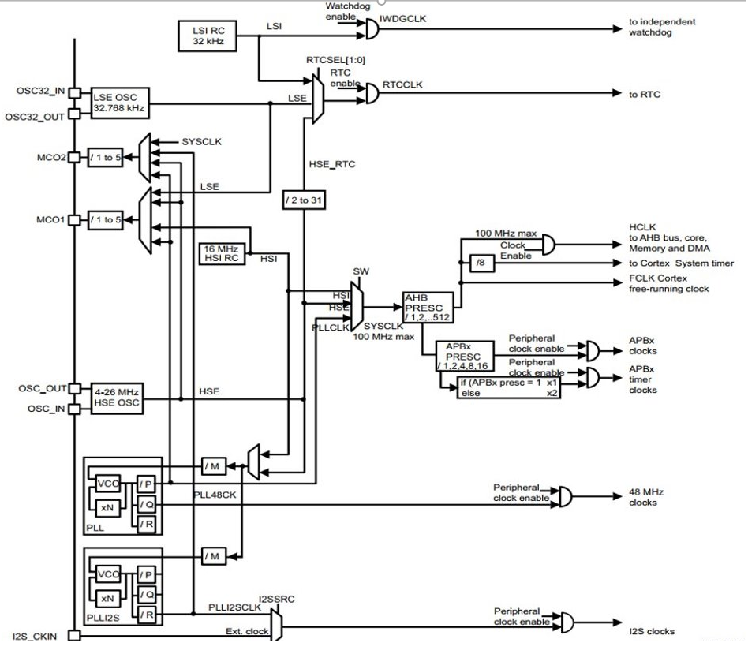

:toc: macro
:icons: font
:figure-caption: Рисунок
:table-caption: Таблица
:toc-title: Оглавление
include::Titul_list_Laba3.adoc[]

toc::[]

---
[.text-left]
== Цель лабораторной работы
Сделать фазовую подстройку частоты (PLL, ФАПЧ). ФАПЧ должен тактироваться на частоте 32 МГц от внутреннего высокочастотного генератора (HSI) 16 МГц.

== Теоретические основы

=== Соглашение об вызовах
Соглашение об вызовах включает в себя:

* Объявление функции
* Компоновка С и С++ кода
* Последовательность использования оперативных регистров и вспомогательные регистровВход в функцию
* Выход из функции
* Обработка адреса возврата

==== Объявление функции
[IMPORTANT]
Функция должна быть объявлена в таком порядке, чтобы компилятор мог узнать как её вызвать.

==== Компоновка С и С++ кода
В C+ +, функция может компоноваться либо как С+ +, либо как С функция. 

Если вы хотите вызвать функции ассемблера из С++, то лучше объявить эту функцию, как имеющую тип компоновки Си

==== Вход в функцию
Параметры передающие в функцию могут использовать два метода:

* Через регистры
* Через стек

Для большей эффективности параметры передаются через регистры, но их число ограничено, поэтому если регистров не хватает, то используется стек. Для передачи параметров используются оперативные регистры *R0:R3*

==== Выход из функции
Функция может вернуть значение. Для возврата значения используются регистры *R0:R1*. Если значение больше 64 бит, то в регистр R0 записывается адрес где лежат данные.

WARNING: Вызывающая функция обязана очистить стек, после того, как вызываемая функция вернула значение.

=== Операторы

Существуют следующие типы операторов:

* Арифметические операторы
* Операторы сравнения
* Логические операторы
* Побитовые операторы
* Составное присваивание
* Операторы работы с указателями и членами класса
* Функторы, тернарные операции, sizeof(), запятая, приведение типа, new

[IMPORTANT]
Все операторы можно переопределить

==== Арифметические операторы
Арифметические операторы предоставляют базовые арифметические действия над типами, такие как сложение, вычитание, деление, умножение, остаток от деления, присваивание.

[#Арифметические операторы]
.Арифметические операторы
[options="header"]
[cols="4,4,4"]
|=====================
|Операция | Оператор | Комментарий
|Присваивание       | =     | a = b
|Сложение           | +     | a + b
|Вычитание          | -     | a - b
|Унарный плюс       | +     | +a
|Унарный минус      | -     | -a
|Умножение          | *     | a * b
|Деление            | /     | a / b
|Остаток от деления | %     | a % b
|Инкремет  (пост и предфиксный)| ++      | &#43;&#43;a  и  a&#43;&#43;
|Декремент (пост и предфиксный)| - -     | --a и a--
|=====================

==== Логические операторы

Логические операторы предоставляют действия над булевым типов. Результат действия этих операторов может быть только *true* или *false*

[#Логические операторы]
.Логические операторы
[options="header"]
[cols="4,4,4,7"]
|=====================
|Операция | Оператор | Комментарий | Пример
|Логическое отрицание, НЕ   | !     | !a    |   !true => false
|Логическое умножение, И    | &&    | a && b| true && false => false
|Логическое сложение, ИЛИ   | &#124;&#124;  |   a &#124; &#124;  b  | true &#124; &#124;  false => true
|=====================

==== Побитовые операторы

Побитовые операторы предоставляют действия с битами.

[#Побитовые операторы]
.Побитовые операторы
[options="header"]
[cols="4,4,4,7"]
|=====================
|Операция | Оператор  | Комментарий | Пример
|Побитовая инверсия   | ~     | ~a  | unsigned char a = 0; ~a => 0xFF
|Побитовое И          | &     | a & b | unsigned char a = 1, b = 3; a & b => 1
|Побитовое ИЛИ        | &#124;   | a &#124; b | unsigned char a = 1, b = 3; a &#124; b => 3
|Побитовое исключающее ИЛИ  | ^   | a ^ b | unsigned char a = 1, b = 3; a ^ b => 2
|Побитовый сдвиг влево  | <<   | a << b | unsigned char a = 1, b = 3; a << b => 8
|Побитовый сдвиг вправо | >>   | a >> b | unsigned char a = 8, b = 3; a >> b => 1
|=====================

=== Ядро CortexM4

* Ядро Cortex построено по гарвардской архитектуре с разделением шины данных и кода. 
* Ядро Cortex-М4 поддерживает 8/16/32-разрядные операции умножения, которые выполняются за 1 цикл (деление со знаком (SDIV) или без (UDIV) занимает от 2 до 12 тактов в зависимости от размера операндов
* Ядро Cortex-М4 поддерживает 8/16/32-разрядные операции умножения со сложением

== Система тактирования

Для формирования системной тактовой частоты SYSCLK могут использоваться 4 основных источника:

* HSI (high-speed internal) — внутренний высокочастотный RC-генератор.
* HSE (high-speed external) — внешний высокочастотный генератор.
* PLL — система ФАПЧ. Точнее сказать, это вовсе и не генератор, а набор из умножителей и делителей, исходный сигнал он получает от HSI или HSE, а на выходе у него уже другая частота. 

Также имеются 2 вторичных источника тактового сигнала:
* LSI (low-speed internal) — низкочастотный внутренний RC-генератор на 37 кГц
* LSE (low-speed external) — низкочастотный внешний источник на 32,768 кГц

=== Фазовая подстройка частоты PLL
PLL Внутренний источник PLL тактируется от внешнего или внутреннего высокочастотных генераторов (HSE либо HSI). 
* С помощью регистров PLLM, PLLN,PLLP можно подобрать любую частоту до 100 Мгц включительно по формуле:
====
   f = f(PLL clock input) × (PLLN / PLLM) /PLLP
====
* Кроме системной тактовой частоты SYSCLK, PLL также выдает частоту 48 МГц для интерфейса USB. При использовании USB входная частота для PLL должна быть в диапазоне от 2 МГц до 24 МГц.
====
   f(USB) = f(PLL clock input) × (PLLN / PLLM) / PLLQ
====

==== Алгоритм настройки частоты
* Определить какие источники частоты нужны
  ** Например, PLL нужен для USB

* Включить нужный источник
** Используя Clock Control register (RCC::CR)

* Дождаться стабилизации источника 
** Используя соответствующие биты (..RDY) Clock Control register (RCC::CR)

* Назначить нужный источник на системную частоту
** Используя Clock Configuration Register (RCC::CFGR)

* Дождаться пока источник не переключиться на системную частоту
** Используя Clock Configuration Register (RCC::CFGR)

== Ход работы

В используемом микроконтроллере STM32F411 есть система тактирования (рисунок 1) и, соответственно, модуль тактирования.

[#Система_тактирования]
.Системы тактирования

Для формирования системной тактовой частоты SYSCLK могут использоваться 3 основных источника:​

* HSI (high-speed internal) — внутренний высокочастотный RC-генератор;
* HSE (high-speed external) — внешний высокочастотный генератор;​
* PLL — система ФАПЧ; набор из умножителей и делителей, в котором исходный сигнал получается от HSI или HSE, а на выходе у него уже другая частота.

Включение и выключение основных генераторов (источников) производится через регистр RCC_CR. 

С помощью регистров PLLM, PLLN, PLLP можно подобрать любую частоту до 100 Мгц включительно по формуле:​
====
   f = f(PLL clock input) × (PLLN / PLLM) /PLLP​
====

Регистр имеет коэффициенты ФАПЧ принимающие различные значения:

* PLLM (2 ≤ PLLM ≤ 63)
* PLLN ( 50 ≤ PLLN ≤ 432)
* PLLP (PLLP = 2, 4, 6, 8)

Чтобы включить PLL нужно установить 24 бит (PLLON). Этот бит устанавливается и скидывается программно. Бит не может быть скинут, если PLL уже используется как системная частота. 

​Сразу после установки частоты, нужно проверить, что частота с нового источника стабилизировалась. Для этого используются поля того регистра CR, оканчивающиеся на RDY (Ready). Для PLL это бит 25 (PLLRDY).

В задаче необходимо добиться частоты 32 МГц с помощью ФАПЧ. Изначально код с частотой тактирования равной 16 МГц (используется источник HSI). 

Предполагаемый результат: после увеличения частоты в 2 раза светодиод должен мигать в 2 раза чаще.

Используя формулу для расчета частоты, нужно подобрать только соответствующие коэффициенты. +
Возьмем коэффициенты: PLLN = 64, PLLM = 4, PLLP = 8. Подставим коэффициенты в формулу:
====
   f = (16'000'000 × (64 / 4)) / 8 = (16'000'000 × 16) / 8 = 32'000'000 Гц = 32 МГц
====

Тогда код программы примет вид:
[source, cpp, linenums]
----
#include "rccregisters.hpp" // for RCC
#include "gpioaregisters.hpp" // for GPIOA
#include "gpiocregisters.hpp" // for GPION

std::uint32_t SystemCoreClock = 16'000'000U;

extern "C"
{
int __low_level_init(void)
{
// Включение внутреннего генератора
RCC::CR::HSION::On::Set();
while (RCC::CR::HSIRDY::NotReady::IsSet())
{
}
// All PLL to 0
*reinterpret_cast<std::uint32_t*>(0x40023804) &= 0;
// PLL with HSI source
RCC::PLLCFGR::PLLSRC::HsiSource::Set();
// PLLP = 8
*reinterpret_cast<std::uint32_t*>(0x40023804) |=(1U << 16U);
*reinterpret_cast<std::uint32_t*>(0x40023804) |= (1U << 17U);
// PLLM = 8
*reinterpret_cast<std::uint32_t*>(0x40023804) |= (1U << 3U);
// PLLN = 128
*reinterpret_cast<std::uint32_t*>(0x40023804) |= (1U << 13U);
// Switch on PLL
RCC::CR::PLLON::On::Set();
while (RCC::CR::PLLRDY::Unclocked::IsSet())
{
}
// PLL on SW
RCC::CFGR::SW::Pll::Set();
while (!RCC::CFGR::SWS::Pll::IsSet())
{
}
RCC::CR::HSION::Off::Set();
RCC::APB2ENR::SYSCFGEN::Enable::Set();
return 1;
}
}
void delay(int cycles)
{
  for(int i = 0; i < cycles; ++i)
  {
    asm volatile("");
  }
}
int main()
{
  
  RCC::AHB1ENR::GPIOAEN::Enable::Set() ;
  RCC::AHB1ENR::GPIOCEN::Enable::Set() ;
  GPIOA::MODER::MODER5::Output::Set() ;
  GPIOC::MODER::MODER5::Output::Set() ;
  GPIOC::MODER::MODER8::Output::Set() ;
  GPIOC::MODER::MODER9::Output::Set() ;
  
  for(;;)
  {
     GPIOC::ODR::ODR8::High::Set();//библиотека синтаксической "обертки"

     //обращение к данным по адресу регистра
     std::uint32_t* ptr = reinterpret_cast<std::uint32_t*>(0x40020814) ;
     *ptr |= (1U << 5U);
     delay(1000000);
     *ptr &= ~(1U << 5U);
     delay(1000000);
  }
  return 1;
}

----
На видео представлен резуьтат работы программы

.Видео - Демонстрация мигания светодиода с частотой тактирования 32 МГц
video::VID_3Lab.mp4[opts="muted"]

== Выводы
[.text-left]
В ходе данной работы была написана программа, в которой была использована система ФАПЧ для получения частоты тактирования 32 МГц.
Также познакомились с основными операторами языка C++.

[.text-center]
== Ответы на контрольные вопросы
[.text-left]
1. Что делает оператор унарный плюс? +
Ответ: Унарный плюс – это один из операторов программирования, который (над целочисленными операндами) выполняет восходящее приведение целого типа. Результирующим типом является тип, до которого повышается уровень операнда. Таким образом, выражение +ch, где ch имеет тип char, приводит к типу int; значение не изменено.
Унарный оператор отрицания (-) выдает отрицательный результат операнда (т.е. противоположный).

[IMPORTANT]
Унарные операторы отрицания и сложения долны иметь арфметический тип.

2. Чтоделает оператор "запятая"? +
Ответ: Оператор "запятая" используется для связки нескольких выражений. Левая сторона оператора "запятая" всегда вычисляется первой, а далее правая часть. Оператор "запятая" вызывает выполнение последовательности действий. Когда он используется с правой стороны оператора присваивания, то присваиваться будет значение последнего выражения, стоящего в разделенном запятыми списке. +
Пример:

[source, cpp, linenums]
[.text-left]
----
int main()
{
  int x, y ;
  x = (y = 5, y * 3) ;
  std::cout << x << std::endl ;
  return 1 ;
}
----

[.text-left]
В данном примере сначала присваивается значение "5" переменной у, а затем значение y*3, т.е. значение "15" переменной х. Скобки необходимы, поскольку оператор "запятая" имеет более низкий приоритет по сравнению с оператором присваивания.

А также оператор "запятая" может быть использован при создании ряда template (шаблона). В таком случае запятая будет стоять в скобках в команде вызова какого-либо числа заданных функций.