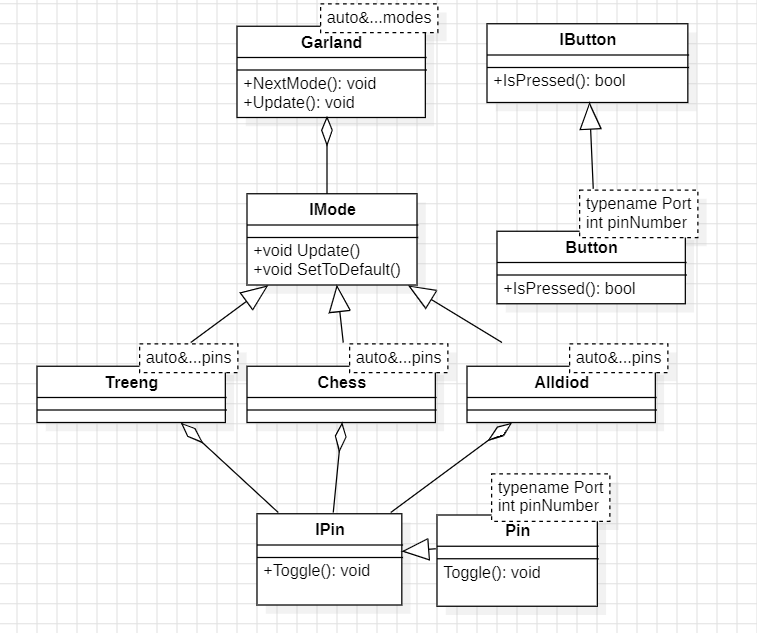

:toc: macro
:icons: font
:figure-caption: Рисунок
:table-caption: Таблица
:toc-title: Оглавление
include::Titul_list_Laba6.adoc[]

toc::[]

---
[.text-left]
== Цель лабораторной работы
Освоить интерфейс программы StarUML для составления UML-диаграмм программы.

== Теория

*StarUML* - программный инструмент моделирования, который поддерживает UML (Унифицированный язык моделирования). + StarUML поддерживает одиннадцать различных типов диаграмм,активно поддерживает подход MDA (Модельно-управляемая архитектура), реализуя концепцию профилей UML. Среда разработки StarUML превосходно настраивается в соответствии с требованиями пользователя и имеет высокую степень расширяемости, особенно в области своих функциональных возможностей. 

Инструмент UML, который адаптируется к пользователю
StarUML предоставляет максимальную степень адаптации среды разработки пользователя, предлагая настройку параметров, которые могут влиять на методологию разработки программного
обеспечения, проектную платформу и язык.

_Главные особенности:_

* точное соответствие стандарту UML;
* открытый формат программной модели;
* поддержка MDA;
* применимость методологий и платформ;
* программная функция проверки модели;
* полезные аддины.

== Задание
Написать программу "Гирлянда", которая будет работать в 3-х режимах: "Шахматы", "Елочка", "Всё светится". Режимы сменяют друг друга при нажатии кнопки. Составить UML-диаграмму программы.
[.text-left]

[#Диаграмма]
.UML-диаграмма

Листинги Pin.h и IPin.h - были представлены в предыдущих отчетах и не понесли никаких изменений.

Листинг IMode.h
[source, cpp, linenums]
----
#ifndef IMODE
#define IMODE

class IMode
{
public:
  virtual void Update() = 0;
  virtual void SetToDefault() = 0;
};

#endif
----

Листинг Alldiod.h
[source, cpp, linenums]
----
#ifndef ALLDIOD
#define ALLDIOD

#include "imode.h" // for IMode
#include <array>

template<auto&...pins>
class Alldiod : public IMode
{
public:
  void Update() override
  {
    for(std::size_t i=0; i < leds.size();i++)
    {
      leds[i]->Toggle();
    }
  }
  void SetToDefault() override
  {
    for(auto it: leds)
    {
      it->Off();
    }
  }
private:
  std::array<IPin*, sizeof ...(pins)> leds = {&pins...};
};

#endif
----

Листинг Treeng.h
[source, cpp, linenums]
----
#ifndef TREENG
#define TREENG

#include "imode.h" // for IMode
#include <array>

template<auto&...pins>
class Treeng : public IMode
{
public:
 void Update() override
  {
    leds[currentLed++]->Toggle();
    if(currentLed == leds.size())
    {
      currentLed = 0;
    }
  }
  void SetToDefault() override
  {
    currentLed = 0;
    for(auto it: leds)
    {
      it->Off();
    }
  }
private:
  std::size_t currentLed = 0;
  std::array<IPin*, sizeof ...(pins)> leds = {&pins...};
};

#endif
----

Листинг Chess.h
[source, cpp, linenums]
----
#ifndef CHESS
#define CHESS

#include "imode.h" // for IMode
#include <array>

template<auto&...pins>
class Chess : public IMode
{
public:
  void Update() override
  {
    if(isOdd) // нечетные светодиоды
    {
      for(std::size_t i = 0; i < leds.size(); i+=2)
      {
        leds[i]->Toggle();
      }
    } else // четные светодиоды
    {
      for(auto it: leds)
      {
        it->Toggle();
      }
    }
    isOdd = false;
  }
  void SetToDefault() override
  {
    isOdd = true;
    for(auto it: leds)
    {
      it->Off();
    }
  }
private:
  bool isOdd = true;
  std::array<IPin*, sizeof ...(pins)> leds = {&pins...};
};

#endif
----

Листинг IButton.h
[source, cpp, linenums]
----
#ifndef IBUTTON
#define IBUTTON

class IButton
{
public:
  virtual bool IsPressed() const = 0;
};

#endif
----

Листинг Button.h
[source, cpp, linenums]
----
#ifndef BUTTON
#define BUTTON

#include <ibutton.h> // for IButton

template<typename Port, int pinNumber>
class Button : public IButton
{
public:
  bool IsPressed() const override 
  {
    return ((Port::IDR::Get()&(1 << pinNumber))!=(1 << pinNumber));
  }
};

#endif
----

Листинг Garland.h
[source, cpp, linenums]
----
#ifndef GARLAND
#define GARLAND

#include "imode.h" // for IMode
#include <array> // for std::array

template<auto& ...presets>
class Garland
{
public:
  void NextMode()
  {
    pCurrentMode->SetToDefault();
    pCurrentMode = mod[i];
    i++;
    if(i == mod.size())
    {
      i = 0;
    }
  }
  void Update()
  {
    pCurrentMode->Update();
  }
private:
  std::size_t i = 0;
  std::array<IMode*, sizeof ...(presets)> mod = {&presets...};
  IMode* pCurrentMode = mod[0];
};
#endif
----

Листинг main.cpp
[source, cpp, linenums]
----
#include "rccregisters.hpp" // for RCC
#include "gpioaregisters.hpp" // for GPIOA
#include "gpiocregisters.hpp" // for GPIOC
#include "Pin.h"
#include "Button.h"
#include "IPin.h"
#include "Alldiod.h"// for Alldiod
#include <iostream>
#include <array>
#include "treeng.h" // for Treeng
#include "chess.h" // for Chess
#include "Garland.h"

std::uint32_t SystemCoreClock = 16'000'000U;

void delay(int cycles)
    {
      for(int i = 0; i < cycles; ++i)
      {
        asm volatile("");
      }
    }

Pin<GPIOA,5> pin1 ;
Pin<GPIOC,9> pin2 ;
Pin<GPIOC,8> pin3 ;
Pin<GPIOC,5> pin4 ;
Treeng<pin1, pin2, pin3, pin4> treeng;
Chess<pin1, pin2, pin3, pin4> chess;
Alldiod<pin1, pin2, pin3, pin4> all;
Garland<all, treeng, chess> garland;
Button<GPIOC, 13> button; // пользовательская кнопка
uint8_t buttonPressedMark = 0;

int main()
{
  //Подать тактирование на порт A
  RCC::AHB1ENR::GPIOAEN::Enable::Set() ;
  //Подать тактирование на порт С
  RCC::AHB1ENR::GPIOCEN::Enable::Set() ;
  //Установка порта А (GPIOA) 5 бит (MODER5) на выход
  GPIOA::MODER::MODER5::Output::Set() ;
  //Порт С.5
  GPIOC::MODER::MODER5::Output::Set() ;
  //Порт С.8
  GPIOC::MODER::MODER8::Output::Set() ;
  //Порт с.9
  GPIOC::MODER::MODER9::Output::Set() ;

  for(;;)
  {
    garland.Update();
    if(button.IsPressed() and buttonPressedMark == 0)
    {
      garland.NextMode();
      buttonPressedMark = 1;
    } else
    {
      buttonPressedMark = 0;
    }
    delay(1000000);
  }
  return 1;
}
----

На видео представлена работа программы "Гирлянда" в 3х режимах.

.Видео - Демонстрация работы гирлянды
video::VID_6.Гирлянда.mp4[opts="muted,loop"]

== Выводы
[.text-left]
В ходе данной работы была написана программа "Гирлянда", которая работает в 3х режимах, переключающихся по нажатию кнопки. Также была созадна UML-диаграмма программы (рисунок 1).

//[.text-center]
//== Ответы на контрольные вопросы
//[.text-left]
// закоментировать или убрать, если таковых нет
